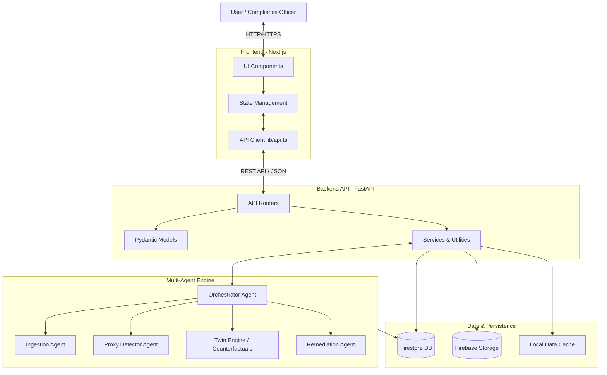
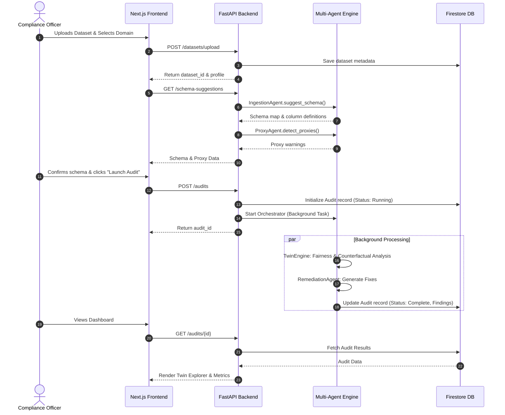

# Equalyze: System Architecture and Process Flow

This document provides architectural and process flow diagrams for the Equalyze system. These diagrams are rendered using Mermaid.js and can be directly used in presentations, documentation, or design specs.

## 1. System Architecture Diagram

This diagram outlines the high-level technical architecture of Equalyze, showing the relationship between the Frontend (Next.js), Backend (FastAPI), Multi-Agent Engine, and Persistence layers.



---

## 2. Process Flow Diagram (Audit Lifecycle)

This process flow details the step-by-step lifecycle of an audit, from dataset upload to final remediation reporting.



---

## 3. Use-Case Diagram

This diagram visualizes the primary interactions different actors have with the Equalyze system.

```mermaid
usecaseDiagram
    actor "Compliance Officer" as CO
    actor "Data Scientist" as DS
    
    package Equalyze {
        usecase "Upload Model Dataset" as UC1
        usecase "Map Schema & Identify Proxies" as UC2
        usecase "Run Bias Audit" as UC3
        usecase "Explore Counterfactual Twins" as UC4
        usecase "Review Remediation Strategies" as UC5
        usecase "Monitor Scheduled Audits" as UC6
    }
    
    CO --> UC1
    CO --> UC2
    CO --> UC3
    CO --> UC4
    CO --> UC5
    
    DS --> UC1
    DS --> UC2
    DS --> UC4
    DS --> UC5
    DS --> UC6
    
    %% Relationships
    UC3 ..> UC2 : <<includes>>
    UC4 ..> UC3 : <<extends>>
    UC5 ..> UC3 : <<extends>>
```
