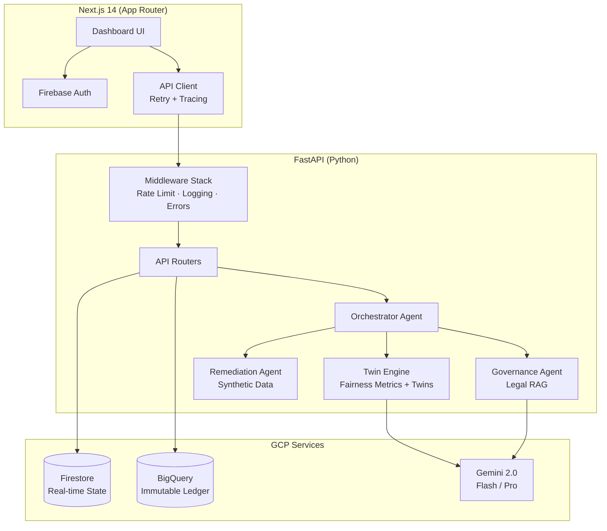

# Equalyze

**AI Bias Detection & Governance Platform**

> Enterprise-grade algorithmic fairness auditing with human-in-the-loop compliance, counterfactual twin generation, and immutable audit trails. Equalyze empowers organizations to deploy AI responsibly by providing transparent, rigorous, and automated bias detection.

---

## 🔒 Compliance Summary

Equalyze is designed to satisfy the following regulatory and industry frameworks:

| Framework | Coverage |
|-----------|----------|
| **EU AI Act** | Articles 10 (Data Governance), 11 (Technical Documentation), 14 (Human Oversight), 15 (Accuracy & Robustness) |
| **India DPDP 2026** | Algorithmic verification, purpose limitation, immutable audit logging |
| **NIST AI 600-1** | Adversarial counterfactual benchmarks, bias measurement |
| **ISO/IEC 42001** | Tamper-proof audit trails for AI Management Systems |
| **ECOA / Title VII** | 4/5ths (80%) rule detection, disparate impact analysis |

See our [Technical Documentation](equalyze-TRD.md) for cryptographic hashing logic and CQRS audit trail architecture.

---

## 🏗 Architecture



---

## 🚀 Features

### Ingestion & Context
- **Universal CSV/XLSX ingestion** with automatic schema parsing
- **Domain selection** (Healthcare, Fintech, HR, Insurance) — dynamically adjusts legal RAG search
- **Proxy variable detection** — AI-powered identification of illegally correlated features

### Twin Engine (Detection)
- **5 fairness metrics**: Demographic Parity, Disparate Impact (4/5ths rule), Equalized Odds, FPR Parity, Individual Fairness
- **Intersectional deep-dive** — composite discrimination (e.g., Rural + Female)
- **Counterfactual twin generation** — Gemini-powered adversarial profiles proving bias narratively

### Enterprise Governance
- **HITL approval flow** — SHA-256 cryptographic approval tokens, role-gated (Compliance Officer)
- **CQRS dual-write** — Firestore (instant UI) + BigQuery (immutable ledger)
- **Cognitive forcing functions** — Article 14-compliant oversight acknowledgments
- **Public audit receipts** — sanitized, shareable compliance reports

### Remediation
- **Synthetic data generation** — privacy-preserving demographic rebalancing
- **Before/after validation** — visual DIR comparison for model retraining decisions

### Enterprise Operations
- **Structured request tracing** — UUID-based `X-Request-ID` across frontend → API → BigQuery
- **Rate limiting** — sliding window per endpoint (in-memory; Redis-ready for production)
- **Security headers** — HSTS, X-Frame-Options, CSP-ready
- **Error standardization** — consistent JSON error envelopes with request correlation
- **CI/CD pipeline** — pytest + ruff + tsc + next lint + Docker build validation

---

## 🛠 Tech Stack

| Layer | Technology |
|-------|-----------|
| Frontend | Next.js 14, React 18, TypeScript, Lucide Icons, Recharts |
| Backend | FastAPI, Python 3.11, Pandas/NumPy |
| AI | Google Gemini 2.0 Pro/Flash, text-embedding-005 |
| Auth | Firebase Auth (custom tokens, 3 RBAC roles) |
| Database | Firestore (real-time), BigQuery (immutable ledger) |
| DevOps | Docker, Cloud Run, GitHub Actions CI |

---

## 💻 Quick Start

### Prerequisites
- Python 3.11+
- Node.js 20+
- Firebase project with Auth + Firestore enabled

### Option A: Docker Compose (Recommended)

```bash
# Clone and configure
cp .env.example .env
# Edit .env with your API keys

docker compose up --build
```
- API: `http://localhost:8000` (Swagger: `http://localhost:8000/docs`)
- Frontend: `http://localhost:3000`

### Option B: Manual

```bash
# Backend
cd api && python3 -m venv venv && source venv/bin/activate
pip install -r requirements.txt
cd .. && uvicorn api.main:app --host 0.0.0.0 --port 8000 --reload

# Frontend (new terminal)
cd frontend && npm install && npm run dev
```

---

## 🔑 Demo Accounts

| Role | Email | Purpose |
|------|-------|---------|
| Data Scientist | `datascientist@equalyze.io` | Full audit workflow, remediation |
| Compliance Officer | `compliance@equalyze.io` | HITL approval, audit resolution |
| Data Engineer | `dataengineer@equalyze.io` | Dataset management, monitoring |

Use the `/api/v1/auth/demo-login` endpoint to generate Firebase custom tokens for each role.

---

## 📋 API Endpoints

| Method | Path | Description |
|--------|------|-------------|
| `GET` | `/health` | Health check + version |
| `POST` | `/api/v1/datasets/upload` | Upload CSV/XLSX for auditing |
| `POST` | `/api/v1/audits/create` | Trigger bias audit pipeline |
| `GET` | `/api/v1/audits/{id}` | Get audit results + findings |
| `POST` | `/api/v1/audits/{id}/resolve` | HITL approval (generates approval_token) |
| `POST` | `/api/v1/auth/demo-login` | Generate demo account token |
| `GET` | `/api/v1/reports/{id}/public` | Public audit receipt |

Full API documentation available at `/docs` (development only).

---

## 🧪 Testing

```bash
# Backend unit tests
pytest api/tests/ -v

# Frontend type check
cd frontend && npx tsc --noEmit

# Frontend lint
cd frontend && npx next lint
```

---

## 📦 Environment Variables

| Variable | Required | Description |
|----------|----------|-------------|
| `GEMINI_API_KEY` | ✅ | Google Gemini API key |
| `GOOGLE_APPLICATION_CREDENTIALS` | ✅ | Path to GCP service account JSON |
| `FIREBASE_ADMIN_CREDENTIALS` | ✅ | Path to Firebase Admin SDK JSON |
| `GCP_PROJECT_ID` | ✅ | GCP project ID |
| `ENVIRONMENT` | ❌ | `development` / `production` (default: development) |
| `FRONTEND_URL` | ❌ | Frontend URL for CORS (default: http://localhost:3000) |
| `BACKEND_URL` | ❌ | Backend URL (default: http://localhost:8000) |

---

## 🏢 Team: Okay Google, Fix This

| Member | Ownership |
|--------|-----------|
| **OmPrakash** | Architecture, deployment, agent orchestration, BigQuery |
| **Havish** | FastAPI backend, fairness metrics engine, security middleware |
| **Om** | Next.js frontend, component library, UX |

---

## 📄 License

Proprietary — Google Solutions Challenge 2026 Submission
